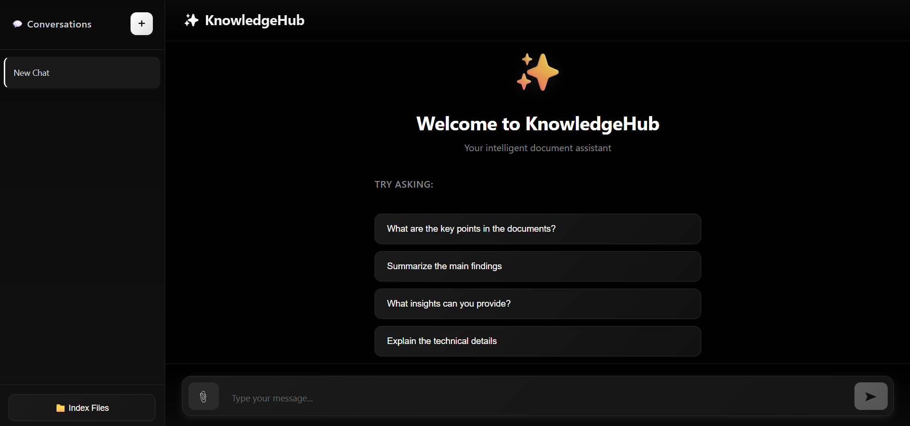

# Advanced Multimodal RAG Chatbot (LangChain + React + Docker)

## Overview

- Backend: FastAPI + LangChain orchestration
- Frontend: React + nginx reverse proxy
- Vector DB: Qdrant (local Docker volume)
- Embeddings:
  - Text: OpenAI embeddings
  - Image: CLIP (`clip-ViT-B-32`)
- Optional reranker: Cohere

## Current UX Flows

1. Index Files
- Upload files from the `Index Files` view.
- Click `Upload and Index` to persist embeddings into Qdrant.

2. Chat
- Ask questions against indexed knowledge.
- Optional file upload is ad-hoc for that message.
- Ad-hoc chat file is not permanently indexed.

## UI Preview



## Supported File Types

- Documents: `.txt`, `.md`, `.pdf`, `.doc`, `.docx`, `.csv`
- Images: `.png`, `.jpg`, `.jpeg`, `.webp`

## Metadata Stored During Indexing

- `doc_id` (auto-generated UUID)
- `chunk_id`
- `uploaded_at` (UTC ISO timestamp)
- `file_type`
- `content_hash` (SHA-256 of raw file bytes)
- `tags` (auto-generated heuristic tags)
- `owner_id` and `tenant_id` (currently stored as `null`)
- `page_no` (placeholder)

## API Endpoints

- `GET /health`
- `POST /upload`
- `POST /ask`
- `POST /ask-with-file`
- `POST /chat`

### Filters

Filtering is supported at API level:
- `owner_id`
- `tenant_id`
- `file_type`
- `tags`

Current frontend does not expose filter inputs by default, but backend supports them via:
- JSON body in `/ask` (`filters`)
- form field JSON in `/chat` and `/ask-with-file` (`filters_json`)

## Startup Behavior

- Backend performs warmup on startup by initializing `RagService`.
- During warmup, `/chat` requests can fail with `502` from frontend proxy because backend is not ready yet.
- Wait for backend logs showing startup completion before sending first request.

## Run

```bash
docker compose up -d --build --force-recreate backend frontend
```

Open:
- Frontend: `http://localhost:8502`
- Backend docs: `http://localhost:8001/docs`

## Persistence

- Qdrant data: `backend/data/qdrant`
- Uploaded files: `backend/data/uploads`

## Notes

- Frontend calls backend via nginx path `/api`.
- Ensure valid provider keys are set in `.env`.
